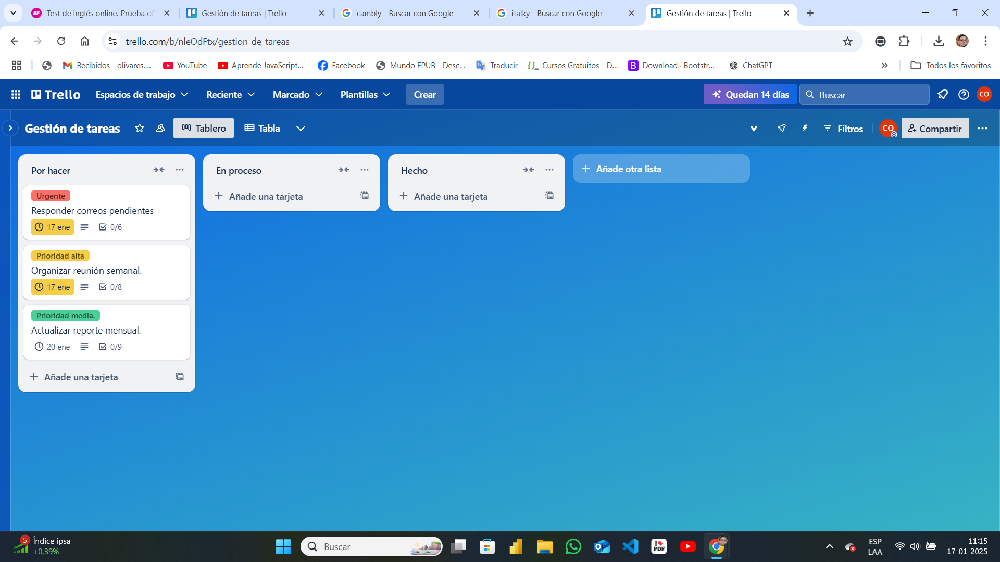
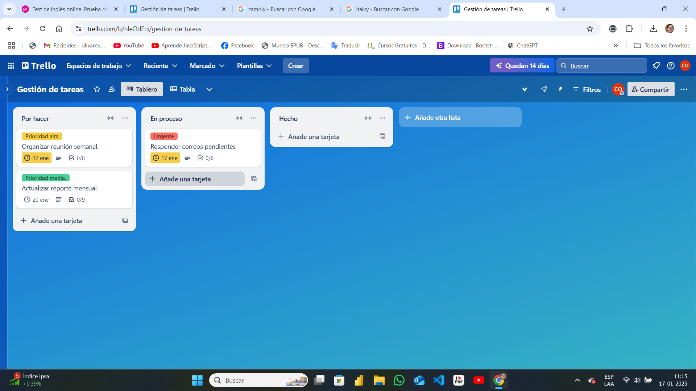
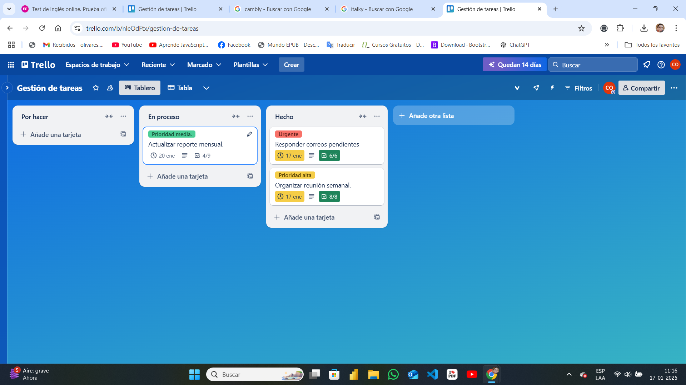
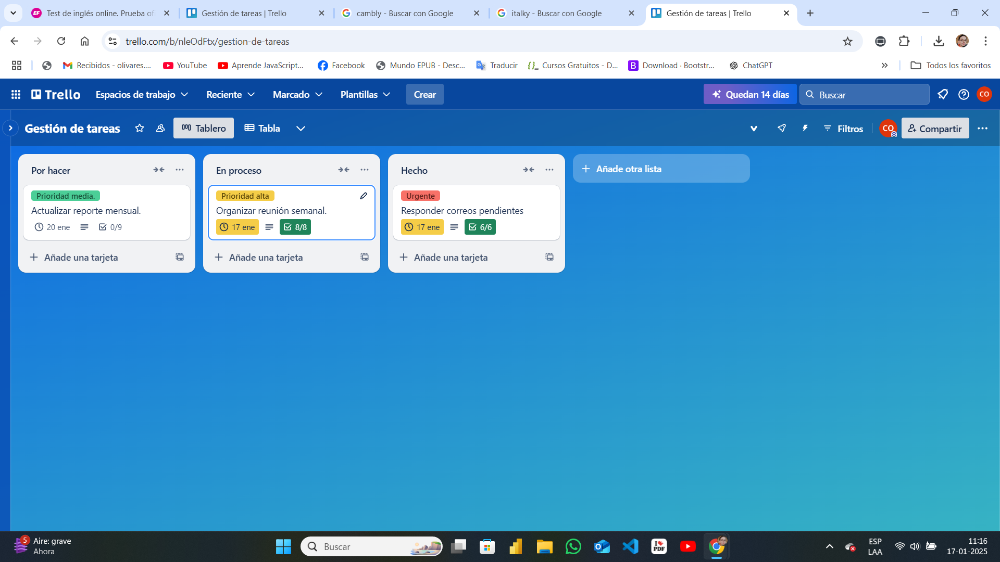
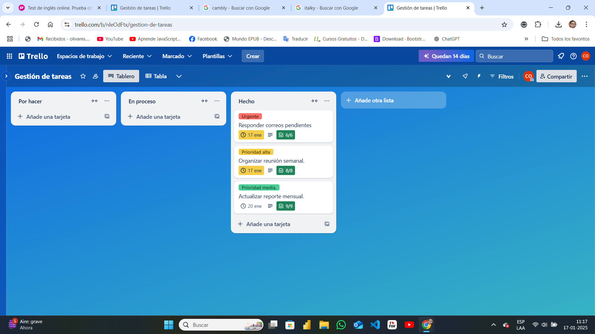

# Gestión de tareas con Trello
- Este proyecto es un ejemplo práctico de cómo utilizar Trello para gestionar tareas de manera eficiente, ideal para roles de asistente virtual o gestión de proyectos. Se simulan tareas reales con una estructura organizada y funcionalidades destacadas.

## Capturas del Tablero

### Vista inicial 

### Vista Intermedia

### Vista Final

## Funcionalidades del Tablero

- Organización de tareas en listas: "Por Hacer", "En Progreso" y "Completadas".
- Uso de etiquetas para priorización (Urgente, Alta, Media).
- Fechas límite asignadas a cada tarea.
- Checklists detallados para seguimiento de subtareas.

## Simulación de Tareas
1. **Responder correos pendientes:** Incluye checklist y etiquetas de prioridad.
2. **Organizar reunión semanal:** Planificación de agenda y coordinación de participantes.
3. **Actualizar reporte mensual:** Creación de gráficos y envío de reportes.

## Conclusión
Este tablero es una muestra de cómo utilizar herramientas digitales para la gestión efectiva de tareas. Es ideal para roles de asistente virtual o gestión de proyectos.
